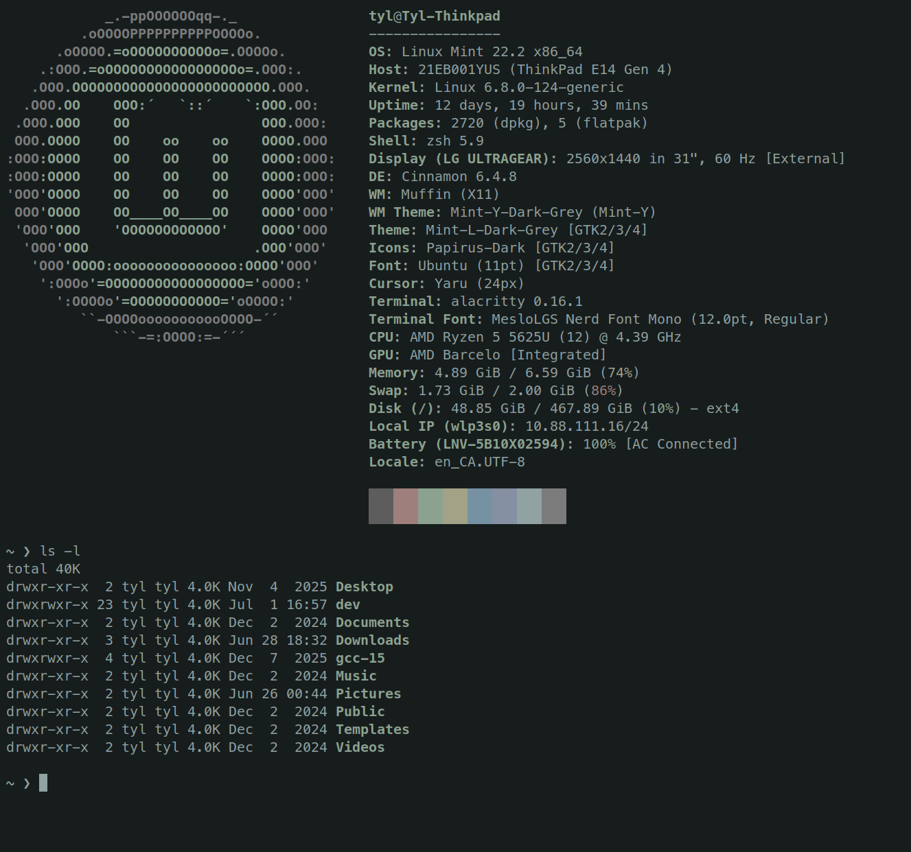

# Elysium: Alacritty



## Usage

Download the [elysium.toml](https://github.com/TheTyl/elysium-alacritty-theme/blob/main/elysium.toml) file to a directory of your choice.
Add an import of the color scheme to your `elysium.toml`:

```
[general]
import = [ "<PATH-TO-DIR>/elysium.toml" ]
```
